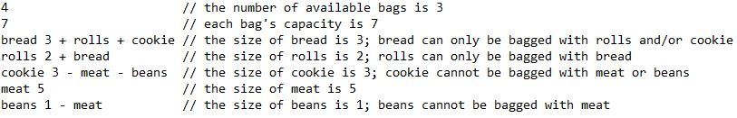

# Bagging Grocery

## Problem Description and Requirements
Grocery Bagging is a real-world application of <b>Constraint Satisfaction Problem (CSP)</b>. The goal is to determine a way to bag all groceries that satisfies multiple constraints: (1) what items can be bagged with what(i.e., rolls can only be bagged with bread; meat cannot be bagged with vegetable) (2) bag capacity (3) the number of bags available. We use '+' and '-' to present a positive constrain or a negative consstrain on the item. The '+' indicates that it is OK to bag the item with anything in the list, but NOTHING else and the '-' indicates that it is NOT OK to bag the item with anything in the list, but you can bag the item with anything else. 

These constraints will be defined in an input file in order. Below is an example of an input file: 

## Compiling and Running
To compile the class file, run: 
$ make 
After executing the make, run: 
$ /bagit.sh <input.txt> 

Replace <input.txt> with the constrains information. Below is a sample input file. 

such as  I used Backtracking search algorithm (Depth-First-Search) along with arc-consistency, Most Restrictive Value (MRV) and Least Constraining Value (LCV) heuristics for prioritizing and pruning to increase tree traversal performance in large problem sets. This project was developed in Java and executed by Makefile and Shell script.

The file will define the problem description, and will contain (in this order):

an integer which is the number of available bags
an integer which is the maximum bag capacity
all the items, sizes, and item constraints, 1 item per line

Following is an example of what a file might contain:

3                   //number of bags available
7                   //maximum bag size is 7
bread  3 + rolls    //1st item size
rolls  2 + bread    //1st item size
squash 3 - meat     //2nd item size
meat   5            //3rd item size
lima_beans 1 - meat //5th item size
