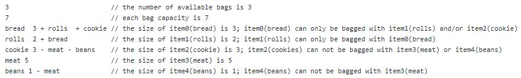
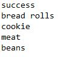

# Bagging Grocery
This is a practice for AI  - Search Algorithm. Grocery Bagging is a Constraint Satisfaction Problem (CSP). The goal is to determine a way to bag all groceries that satisfies multiple constraints. I used Backtracking search algorithm (Depth-First-Search) along with arc-consistency, Most Restrictive Value (MRV) and Least Constraining Value (LCV) heuristics for prioritizing and pruning to increase tree traversal performance in large problem sets. This project was developed in Java and executed by Makefile and Shell script.

## Problem Description and Requirements
Grocery Bagging is a real-world application of <b>Constraint Satisfaction Problem (CSP)</b>. The goal is to determine a way to bag all groceries that satisfies multiple constraints: (1) what items can be bagged with what(i.e., rolls can only be bagged with bread; meat cannot be bagged with vegetable) (2) bag capacity (3) the number of bags available. We use '+' and '-' to present a positive constrain or a negative consstrain on the item. The '+' indicates that it is OK to bag the item with anything in the list, but NOTHING else and the '-' indicates that it is NOT OK to bag the item with anything in the list, but you can bag the item with anything else. 

These constraints will be defined in an input file in order. Below is an example of an input file: 

 
 
If the program can find a solution, it prints "success", followed by what items are bagged in each non-empty bag. If the program cannot find a solution, it just prints "failure". An example of such output would be (taken from the above problem): 

 

## Design and Data Structures

Selecting an appropriate search algorithm and heuristics to solve the problem as efficiently as  possible is the key of the project. I used a **Stack of State** to implement **Backtracking search (Depth-First-Search)** along with **arc-consistency algorithms**, **Most Restrictive Value (MRV) heuristic** and **Least Constraining Value (LCV) heuristic** for prioritizing and pruning. 

 - **DFS(Backtracking Search)** 
   - implemented a Stack of States 
 - **Arc-consistncy:**
   - The arc_consistency algorithm updates the compatible bags of the items at each State so that we could prune the “inconsistent” nodes(the domains in this case are bags) as much and as early as possible BEFORE selecting from them
   - Implemented a HashMap mapping items to its compatible bags
 - **Most Restrictive Value (MRV)**
   - The MRV is applied to sorting the items from the most restricted to the least. So items were first prioritized by the number of incompatible items it has and then by the size of the item. Therefore, the items that are more difficult to be put in a bag are always being tried first
   - Implemented a HashSet mapping items to its conflicting items
 - **Least Constraining Value (LCV)**
   - The LCV is applied to sorting the bags. Here, bags were tried in order that would make the smallest impact on the overall problem. Therefore, bags that have a lot of constraints but could fit and add the item are the best bags to try first. Empty bags could be tried last and only one of those bags needed to be tried
   - Implemented a HashSet mapping bags to its conflicting items

## Compiling and Running
To compile the class file, run: 
$ make 
After executing the make, run: 
$ /bagit.sh <input.txt> 
