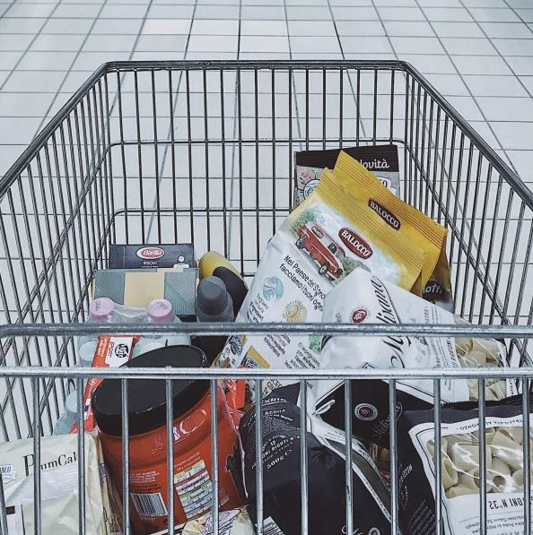

# Bagging Grocery

## Overview
This was one of my projects for my artificial intelligence course. We were tasked with developing an agent that, given a formatted list of grocery items with constraints (i.e., bread can only be bagged with cookies), would output a list of newline separated strings, which represents how our agent decided to bag the groceries. We represented several different methods for deriving solutions, including DFS/BFS search through a decision tree with optional decision pruning and arc-consistency checking to increase tree traversal performance in large problem sets.

## Compiling and Running
To compile the class file, run:

$ make

After executing the make, run:

$ /bagit.sh <input.txt>

Replace <input.txt> with the constrains information. Below is a sample input file. 

